

  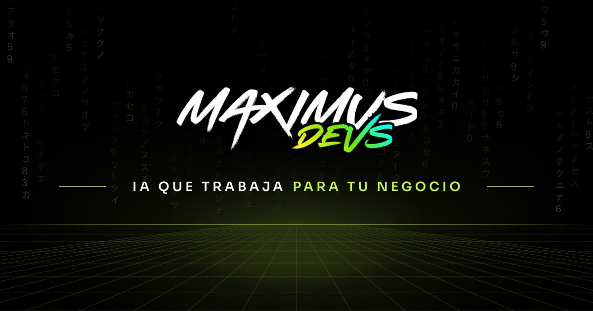

  

<h3 align="center">
  Construyendo el software del mañana, hoy
</h3>

  Diseño, seguridad y tecnología de vanguardia para productos que sí se usan. 
  Sitio bilingüe · ES / EN · Costa Rica

  
  
  
  
  

  
  
  
  

---

## Qué construimos

<table>
  <tr>
    <td width="33%" valign="top" align="center">
      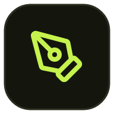
        
      <strong>Diseño y UX</strong>
        
      Interfaces claras, investigación de usuarios y sistemas de diseño accesibles (WCAG).
    </td>
    <td width="33%" valign="top" align="center">
      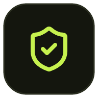
        
      <strong>Seguridad</strong>
        
      Auditorías, cifrado y cumplimiento (SOC 2, GDPR, HIPAA, PCI-DSS).
    </td>
    <td width="33%" valign="top" align="center">
      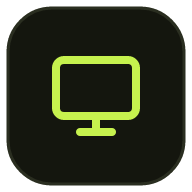
        
      <strong>Web</strong>
        
      Apps rápidas con Next.js y React, pensadas para Core Web Vitals.
    </td>
  </tr>
  <tr>
    <td width="33%" valign="top" align="center">
      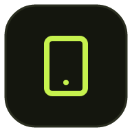
        
      <strong>Móvil</strong>
        
      iOS y Android nativo o multiplataforma. Offline-first cuando hace falta.
    </td>
    <td width="33%" valign="top" align="center">
      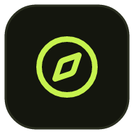
        
      <strong>Consultoría</strong>
        
      Roadmaps, arquitectura y modernización de sistemas legacy.
    </td>
    <td width="33%" valign="top" align="center">
      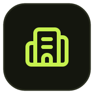
        
      <strong>Industrias</strong>
        
      FinTech, empresa, salud, e-commerce e IA conversacional.
    </td>
  </tr>
</table>

## Stack

  
  
  
  
  
  
  
  
  
  
  
  

## Proyectos

<table>
  <tr>
    <td width="33%" valign="top" align="center">
      <a href="https://maximusdevs.com/es/projects/signaloo">
        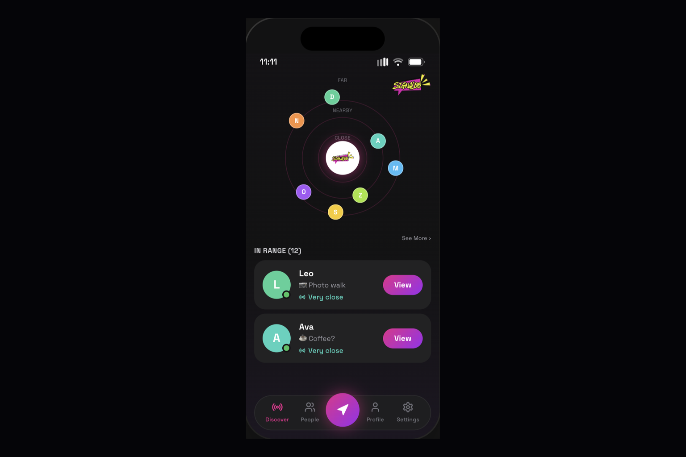
      </a>
       
      <strong><a href="https://maximusdevs.com/es/projects/signaloo">Signaloo</a></strong> 
      iOS · Bluetooth Finder 
      <a href="https://apps.apple.com/us/app/signaloo/id6781836974">App Store</a>
    </td>
    <td width="33%" valign="top" align="center">
      
       
      <strong><a href="https://maximusdevs.com/es/projects/maximus-explorer">Maximus Explorer</a></strong> 
      Android TV · File Transfer 
      <a href="https://maximusdevs.com/downloads/maximus-explorer-1.0.11.apk">Descargar APK</a>
    </td>
    <td width="33%" valign="top" align="center">
      
       
      <strong><a href="https://maximusdevs.com/es/projects/qa-console">QA Console</a></strong> 
      Web · QA with IA agents
    </td>
  </tr>
</table>

## Cómo trabajamos

<table>
  <tr>
    <td width="25%" valign="top" align="center">
      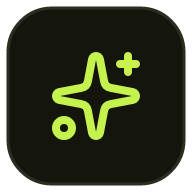
        
      <strong>Innovación</strong>
       
      Tecnología al servicio del producto, no al revés.
    </td>
    <td width="25%" valign="top" align="center">
      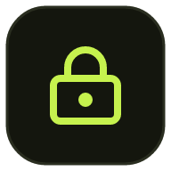
        
      <strong>Seguridad</strong>
       
      Cada decisión considera el dato del cliente.
    </td>
    <td width="25%" valign="top" align="center">
      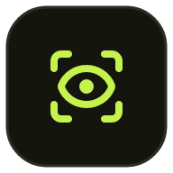
        
      <strong>Transparencia</strong>
       
      Comunicación directa y acuerdos claros.
    </td>
    <td width="25%" valign="top" align="center">
      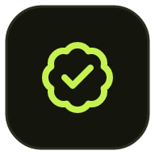
        
      <strong>Excelencia</strong>
       
      Calidad en el detalle, sin importar la escala.
    </td>
  </tr>
</table>

## Contacto

  <strong><a href="mailto:info@maximusdevs.com">info@maximusdevs.com</a></strong>
  · Costa Rica / remoto
  · respuesta &lt; 24 h

  
  

  © 2026 MaximusDevs · Todos los derechos reservados

